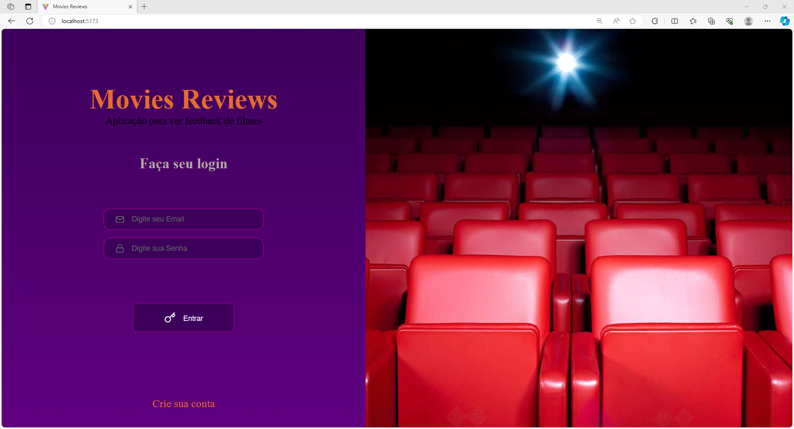
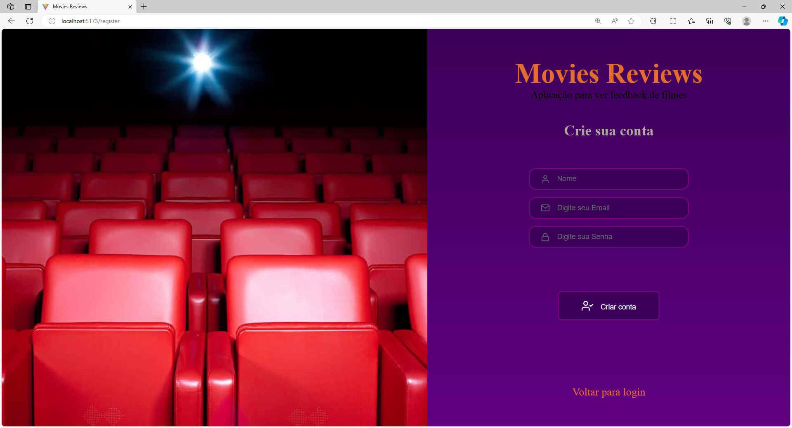
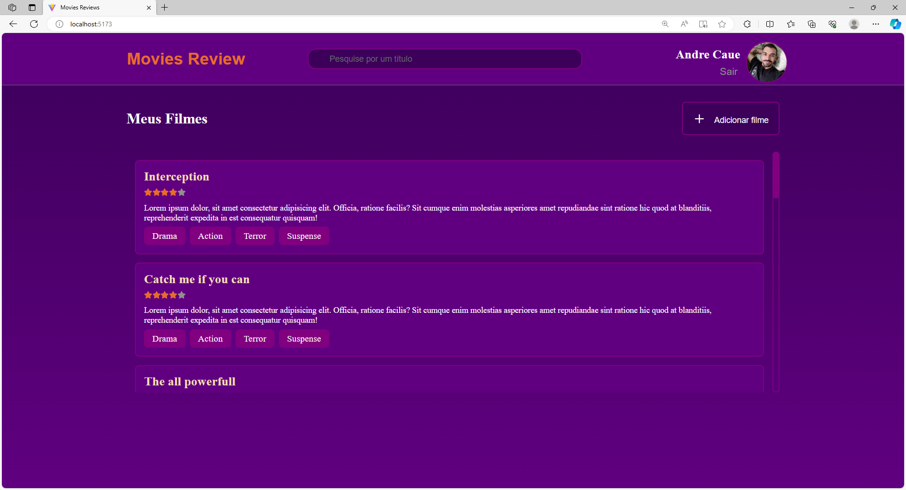
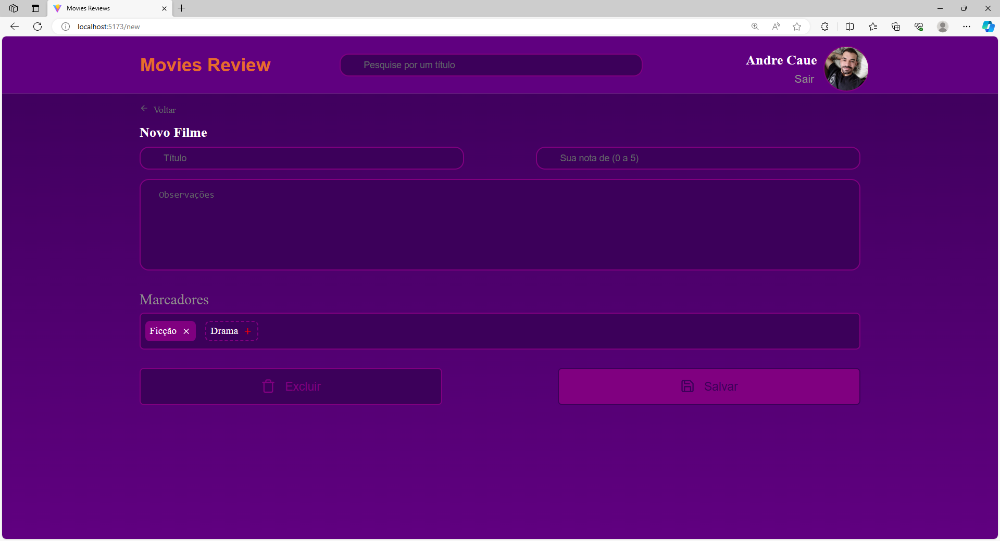
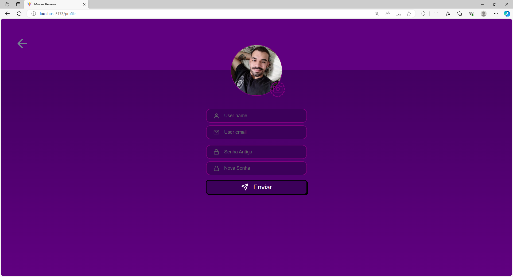
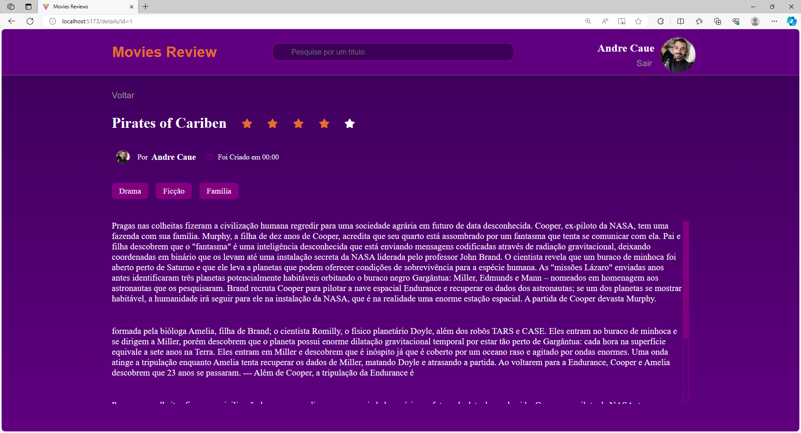

<p align="center">
   
</p>
<h1 align="center">
  
</h1>

<h4 align="center"> 
	🚧  Movies Reviews 🚀 em andamento 🚧
</h4>

<p align="center">
 <a href="#-sobre-o-projeto">Sobre</a> • 
 <a href="#-como-executar-o-projeto">Como executar</a> • 
 <a href="#-tecnologias">Tecnologias</a> • 
 <a href="#user-content--licença">Licença</a>
</p>


## 💻 Sobre o projeto

Movies Review - WebApp feito com o intuito de reduzir o tempo de procura de filmes, dando ao usúarios a possibilidade de compartilhar
suas experiências e avaliando o filmes de acordo com suas opniões. 


---

### Web

<p align="center" style="display: flex; align-items: flex-start; justify-content: center;">
  
  
  
  
  
  
  
</p>

---

## 🚀 Como executar o projeto

Este projeto é front end (temporariamente) -
1. Frontend (pasta web)
2. Backend (em processo)

### Pré-requisitos

Antes de começar, você vai precisar ter instalado em sua máquina as seguintes ferramentas:
[Git](https://git-scm.com), [Node.js](https://nodejs.org/en/). 
Além disto é bom ter um editor para trabalhar com o código como [VSCode](https://code.visualstudio.com/)


#### 🧭 Rodando a aplicação web (Frontend)

```bash

# Clone este repositório
$ git clone https://github.com/Andre-G-C-Araujo/movieReview.git

# Acesse a pasta do projeto no seu terminal/cmd
$ cd movies-review

# Instale as dependências
$ npm install

# Execute a aplicação em modo de desenvolvimento
$ npm run start

# A aplicação será aberta na porta:5173 - acesse http://localhost:5173

```

---

## 🛠 Tecnologias

As seguintes ferramentas foram usadas na construção do projeto:

#### **Website**  ([React](https://reactjs.org/)
-   **[React Router Dom](https://github.com/ReactTraining/react-router/tree/master/packages/react-router-dom)**
-   **[React Icons](https://react-icons.github.io/react-icons/)**
-   **[Vite.JS](https://vitejs.dev/)**
-   **[HTML]()**
-   **[CSS]()**
-   **[JavaScript]()**


#### [](https://github.com/Andre-G-C-Araujo/movieReview#utilit%C3%A1rios)**Utilitários**

-   Editor:  **[Visual Studio Code](https://code.visualstudio.com/)** 
-   Ícones:  **[Feather Icons](https://feathericons.com/)**,  **[Font Awesome](https://fontawesome.com/)**

---


## 📝 Licença

Este projeto esta sobe a licença [MIT](./LICENSE).

Feito com ❤️ por André Garcia 👋🏽 [Entre em contato!](https://www.linkedin.com/in/andre-caue-b72a03287/)

---
